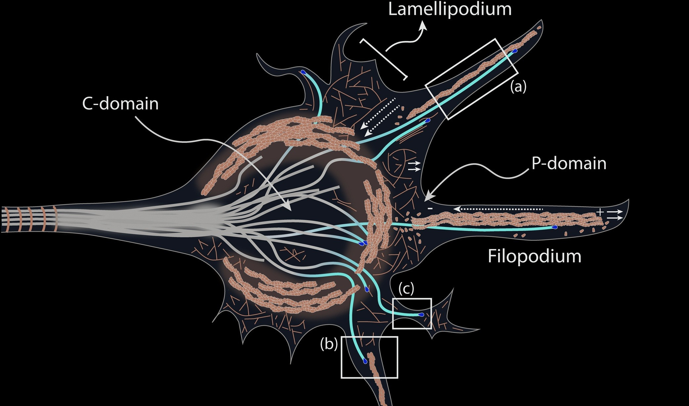
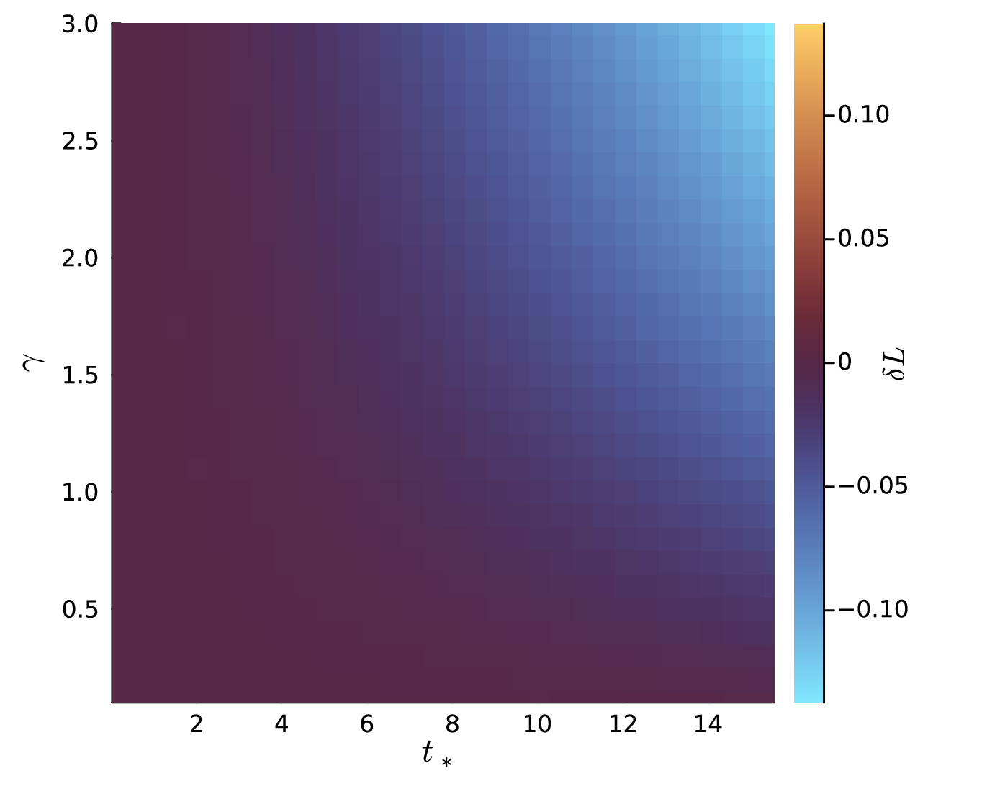

---
# You can also start simply with 'default'
theme: seriph
# random image from a curated Unsplash collection by Anthony
# like them? see https://unsplash.com/collections/94734566/slidev
background: https://cover.sli.dev
# some information about your slides (markdown enabled)
title: Intracellular Transport and Neurite Dynamics
info: |
  ## Slidev Starter Template
  Presentation slides for developers.

  Learn more at [Sli.dev](https://sli.dev)
# apply unocss classes to the current slide
class: text-center
# https://sli.dev/features/drawing
drawings:
  persist: true
# slide transition: https://sli.dev/guide/animations.html#slide-transitions
transition: fade-out
# enable MDC Syntax: https://sli.dev/features/mdc
mdc: true

# open graph
# seoMeta:
#  ogImage: https://cover.sli.dev
---

# Intracellular Transport and Neurite Dynamics

Aiden Sintavanuruk

<!-- 
 -->
<!--   Press Space for next page <carbon:arrow-right /> -->
<!-- 
 -->

  <!-- <button @click="$slidev.nav.openInEditor()" title="Open in Editor" class="slidev-icon-btn"> -->
  <!--   <carbon:edit /> -->
  <!-- </button> -->
  <!-- <a href="https://github.com/mathmd/..." target="_blank" class="slidev-icon-btn"> -->
  <!--   <carbon:logo-github /> -->
  <!-- </a> -->

<!--
Good afternoon everyone. I'm going to present you my current modeling project which relates intracellular transport to neurite dynamics.
-->

---
transition: fade-out
layout: default
---

# Recap from the last talk

Idea: transport-driven neuronal growth

- Growth has to uptake mass.
- Delivery of mass to the tips.
- Recycling of mass.
 
 

<!--
You can have `style` tag in markdown to override the style for the current page.
Learn more: https://sli.dev/features/slide-scope-style
-->

<!--
This is a continued work from the last time I presented couple
 months ago.

So the idea is we want to consider neuronal growth as driven by
 material transport. (draw intracellular mass, source)

The key assumptions here is that the growth of neurite has to
spend material to grow. (draw)

That means that material has to be delivered to the tips.

And conversely, when a tip retracts, it returns material back
to the system (draw); that is we allow recycling of mass.
-->

---
layout: default
drawings:
  persist: false
---

# Formally,

<v-click>

- morphological changes: &nbsp;&nbsp; $\Gamma_t\mapsto\Gamma_{t+\delta t}$
</v-click>  
<v-click>

  - material: &nbsp;&nbsp;$u(\cdot,t):\Gamma_t\to \mathbb{R}_{+}$ &nbsp;&nbsp; such that
<v-click>
$$
\partial_t u + \partial_x (b u) - \partial_{xx}u = s \quad\text{in}\quad \Gamma_t
$$
</v-click>
</v-click>  
<v-click>

- no-flux/flux conservation at all vertices **except** growing tips
</v-click>
<v-click>

- At growing tips:  
</v-click>
<v-after>
$${1|all}
\begin{aligned}
bu - \partial_x u &= (u+\kappa)\dot{L}\\
\dot{L} &= \gamma u - \rho
\end{aligned}
$$
</v-after>

<!--
Formally, (click)
we represent the morphological changes of a neuron as the dynamic
of structure called a metric graph, which is a graph whose edges
are identified as intervals joined at vertices.

For example, what is drawn here could be the metric graph at
time t. (draw)
And this dashed line could be added to the structure so that
this become the graph after time \delta t. (draw)

(click) the material is represented by a density function u
on this graphs. And we can write down an equation governing
the transport dynamics. 
In this case, we have advection rate b (draw)
which can be thought as "background flow" or "active process"
We also have diffusion term, and (draw) source or sink term.

(click) at the vertices we assume...

(click) at the growing tips, we have the flux (draw) matches
the how material move at the rate L,
 subtracted by construction cost.
(click) the elongation rate depends on locally available material.
-->

---
layout: image-right
---

# Question:

Assuming same growth and transport:

<v-clicks>

- same growth rate&nbsp;&nbsp;$\gamma$&nbsp;&nbsp;and cost&nbsp;&nbsp;$\kappa$
- same transport&nbsp;&nbsp;$b$,
</v-clicks>

 

<v-after>

#### **How can a neuron pick a single neurite out of many and makes it grows the longest?**
</v-after>

<!--
Now, we are inspired by what could happen in a very early stage
of neuron differentiation,
when, hypothetically, every neurite start out the same.
However, we all know that at the end there's going to be an axon
emerging out of these.

The question is that,
(click) if we assume the same growth rule and transport dynamics,
in the sense that
(click) ... (click) ...

How... 

so we explore how topological changes affect the growth,
rather than the intrinsic rules of growth and transport.
-->

---
layout: two-cols
dragPos:
  gcpos: 565,361,293,_
---

# Branch-and-retract

::right::

# Compound tip

<!--
So we had two ideas that this could happen.

one is to have a neurite branches and then retracts.

The other is to have a special structure at the tip where
a neurite grows, and we will call it compound tip.

In the first case, the initial condition...

Once the transport happens...

Then, after some time retraction happens...

For the other case, the left neurite is the same,
but the right one has multiple additional growing tips attached
to the main growing tip. And we let the smaller tips retract
periodically, feeding the material to the main growing tip.

note that the difference between this and before...

(click) This configuration is inspired by the growth cone...
-->

---
layout: image-right
image: "./figures/branching.png"
backgroundSize: contain
dragPos:
  diagpos: 529,226,413,_
---

# Branch-and-retract

---
layout: image-left
image: "./figures/compound.png"
backgroundSize: contain
---

# Compound tip

---
layout: center
---

# Implications

<v-clicks>

- Growth cone retraction could facilitate mass delivery at the neurite tip.
- Despite the ability to absorp more mass, branching does not give length advantage.
</v-clicks>

---
